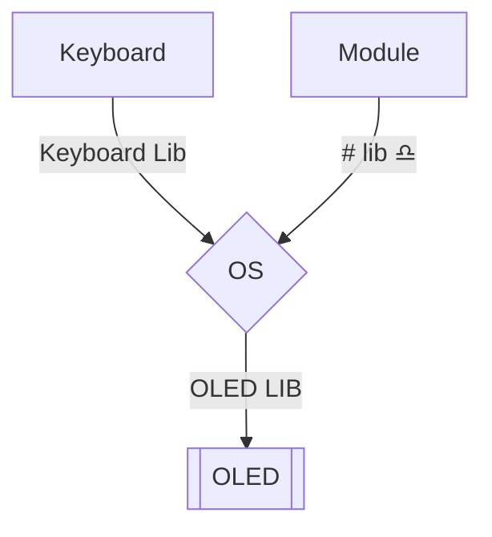

### Plan



```mermaid
    flowchart TD
    K[Keyboard] -->|Keyboard Lib| OS{OS}
    OS{OS} --> |OLED LIB|O[[OLED]]
    M[Module]  --> | # lib ♎| OS

```


# oled lib
```c

#define oled_address 0x3c

#include <stdio.h>

int main(){
    if(running){
        printf("ghamand nhi krna");
    }
    return 0;
}

```