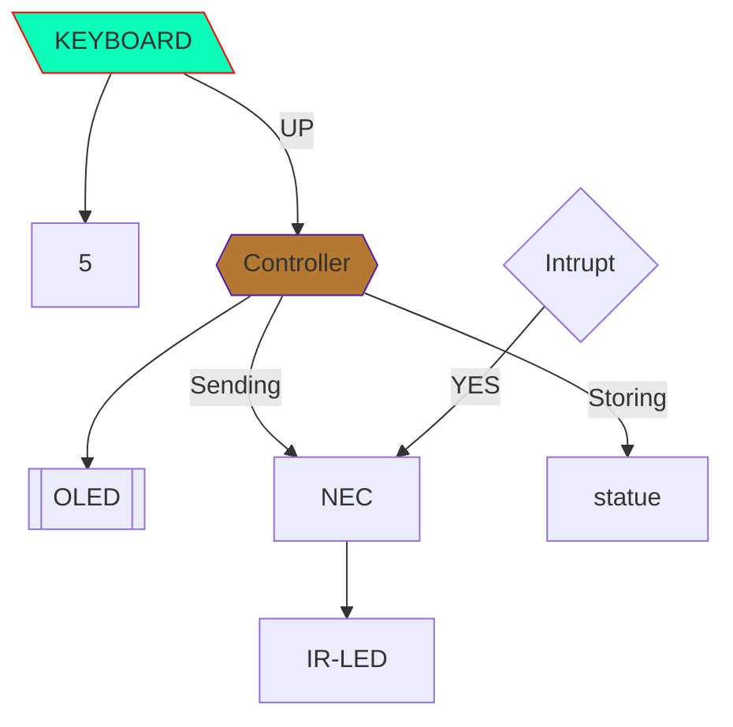

### Module

Creating a multipurpose module

### Objective

- Work #In-Progress

    - [ ] Creating a `purf board` design using `blue-pill`
    - [ ] attaching components
        - [x] 4 - `Input Buttons`
        - [ ] 1 - `OLED 128x64`
    

    - [ ] Features 
        - [ ] Interrupt
        - [x] LCD driver
        - [x] NEC protocol Driver
        - [ ] Radio Transmitter
        - [x] Radio Reciever
        - [ ] Connector module
        - [x] Programm runner
        - [ ] Walky Talky
            - Controller
            - Speaker
            - Microphone
            - Radio Send
            - Radio Recieve

#### Program Loader Flow

### Tasks to do

    - Software
        - Programm runner #WIP⏳
        - Program name to be display ⏳
        - Storage Manager ⏳
        - About page ⏳

