### Plan

### Decided
 - [x] Item
    - Item
        - Hame


- [x] Test
- [ ] Build

# Project

- [Introduction](#introduction)
- [Installation](#installation)
- [Usage](#usage)


#### [Goggle](https://www.google.com/)

USE `protocol()` function to start `communicating`

> this is a quote

***

|Name|Age|City|
|:----|:---:|----:|
|Sunil Kumar|38|<details><summary>Game</summary> ``` Hello ``` </details>|

1. Fruits
   - Apple
   - > [Introduction](#introduction)

2. Vegetables
   - Potato
   - Onion

> [!NOTE]
> This is a note.
> develper 


### Mathematics
$$
x = \frac{-b \pm \sqrt{b^2-4ac}}{2a \int \frac{an-2}{b^2}}
$$


## Introduction

## Installation

## Usage

```
      ┌------------┐                    
----->│ Display    │
      │            |
      └────────────┘ 
            ↑
      ┌------------┐
----->│ Controller │
      │            |
      └────────────┘
            ↑
      ┌------------┐                    
----->│ Interface  │
      │            |
      └────────────┘ 


        <------ Period T ------>
      ┌────────┐      ┌────────┐
CLK───┘        └──────┘        └────► Time
      ↑        ↑      ↑
   Rising   Falling Rising

   
```


> [!SUCCESS]
> Information

> [!TIP]
> Success

> [!WARNING]
> Warning

> [!IMPORTANT]
> Important


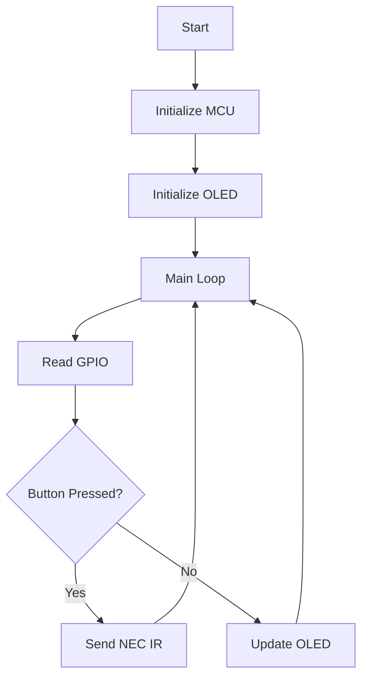

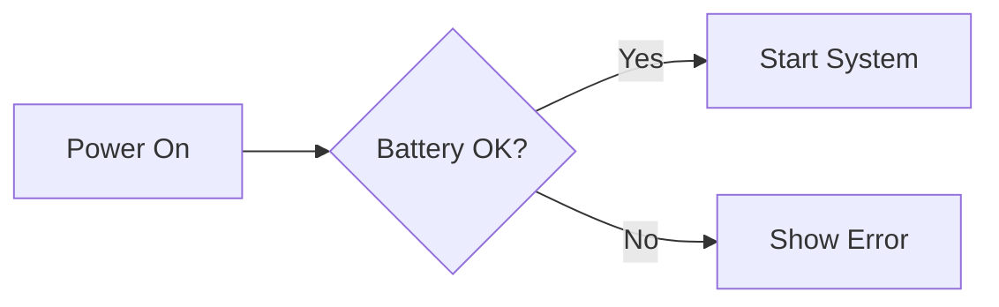


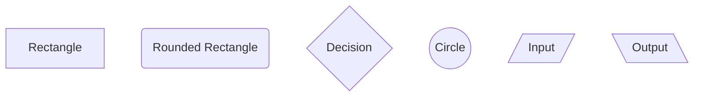

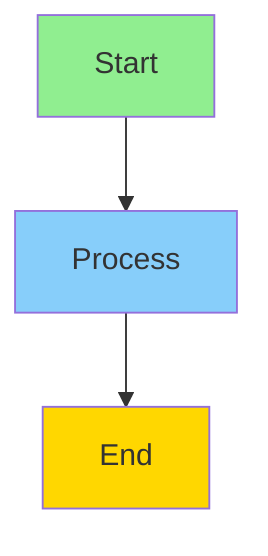

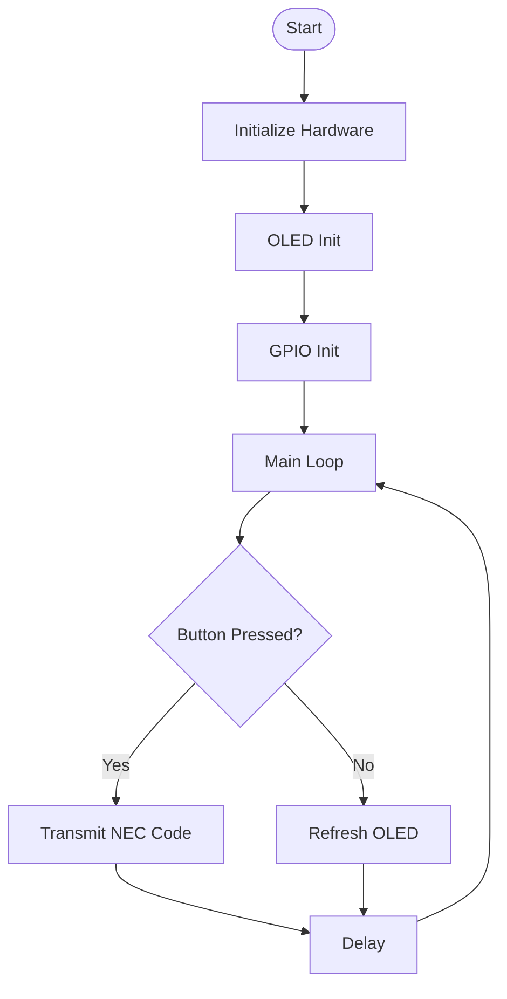

### Sequence
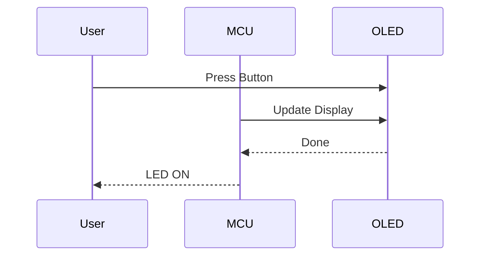


### state diagram

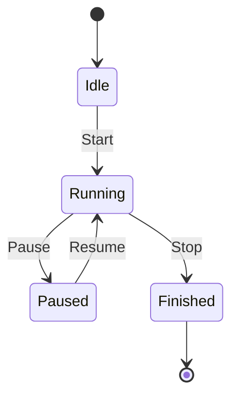

### Class Diagram

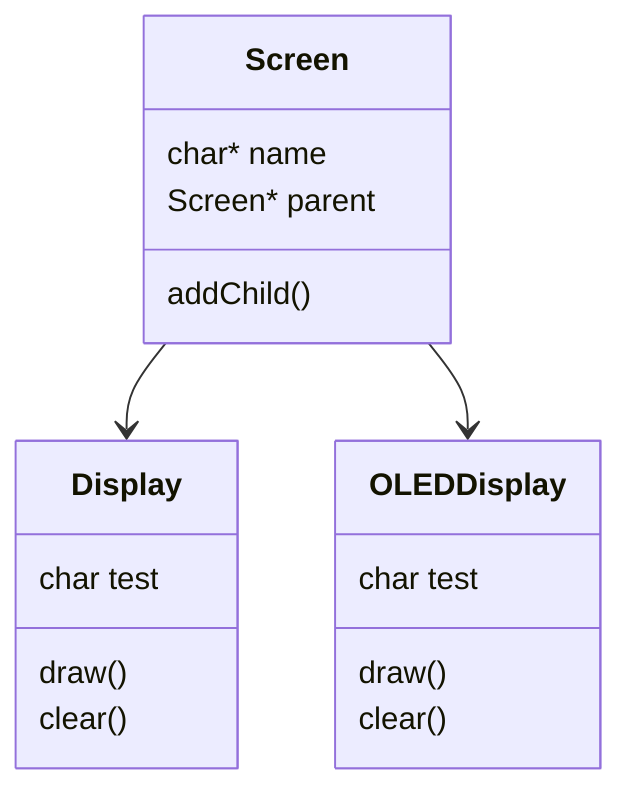


### Entity Diagram

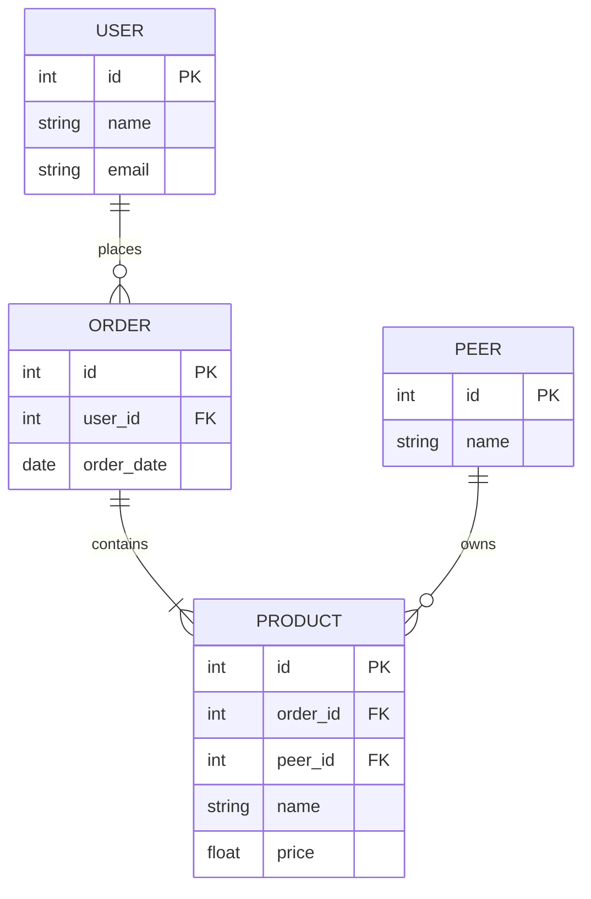

### git graph
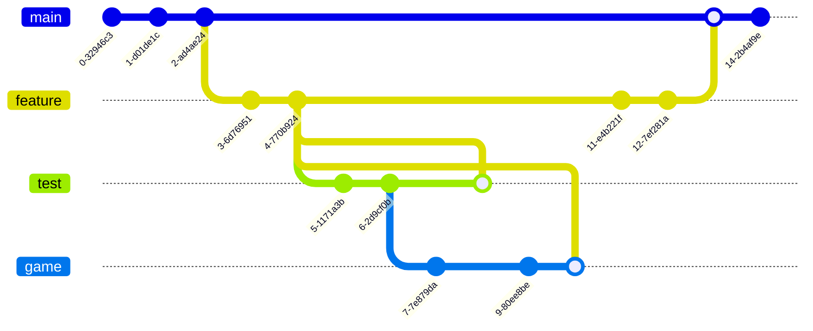


### Grant Chart
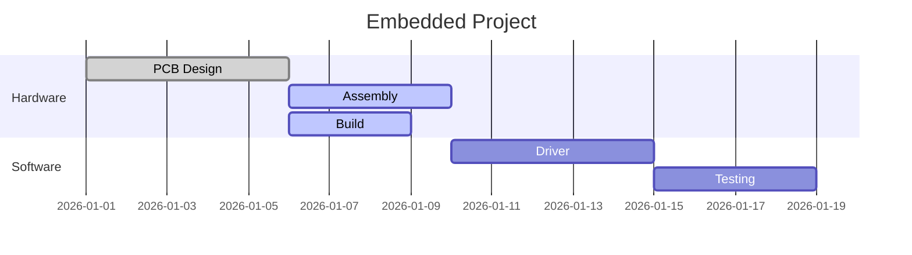


### Pie chart

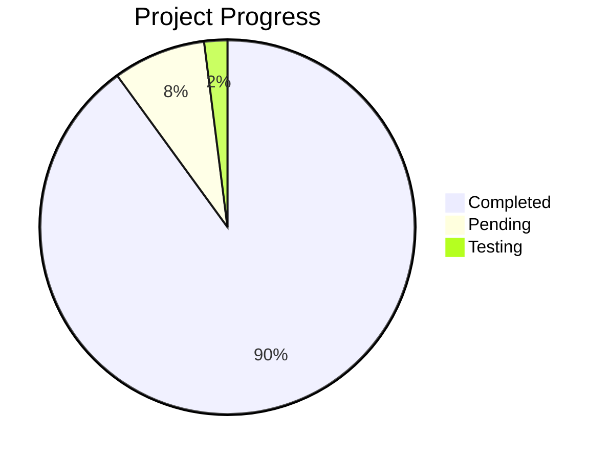


### Mind Map

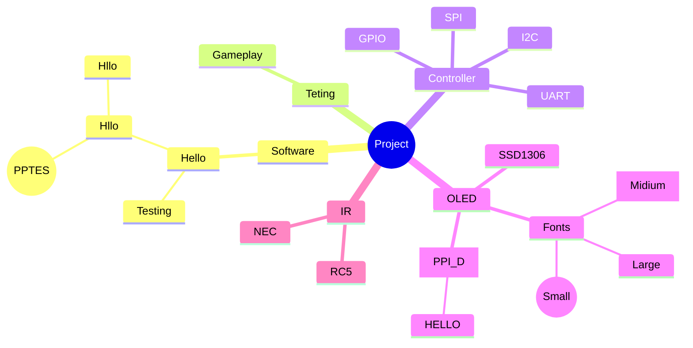


### Time Line

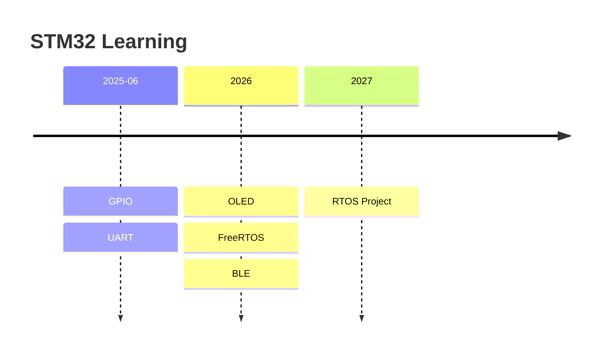

```vega-lite
{
  "mark": "bar",
  "data": {
    "values": [
      {"module":"GPIO","value":100},
      {"module":"UART","value":80},
      {"module":"Test","value":10}
    ]
  },
  "encoding": {
    "x": {"field":"module","type":"nominal"},
    "y": {"field":"value","type":"quantitative"},
    "color": {"field":"module"}
  }
}
```


### Journey Diagram

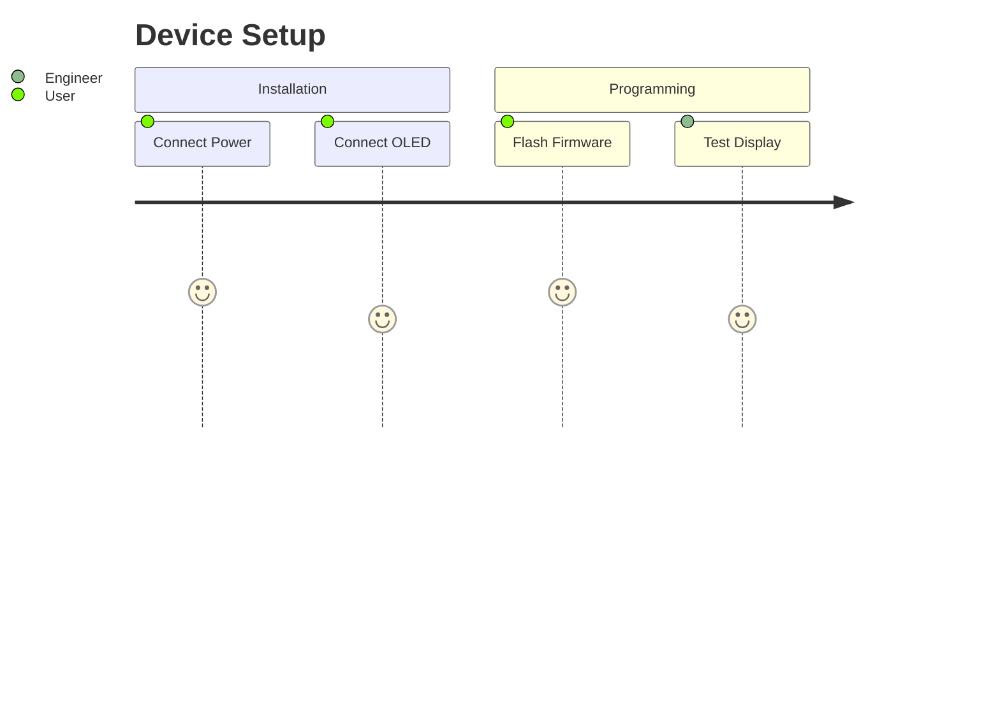


### Requirement Diagram

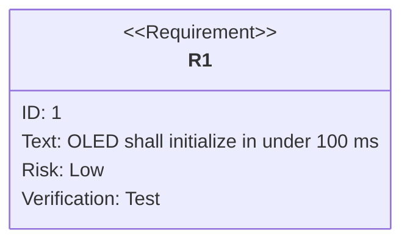


### Footnotes
STM32 supports multiple timers.[^1]

[^1]: See the reference manual.

### Math

$
F = (ma^{\sin (2 \cdot\theta)^2\int {5+\frac{\pi}{\exp}}})^{\pi - 4}
$

<kbd>Ctrl</kbd> + <kbd>C</kbd>


### Defination List
GPIO
: General Purpose Input Output

UART
: Universal Asynchronous Receiver Transmitter


### Video Demo
<video controls width="400">
    <source src="demo.mp4" type="video/mp4">
</video>


```wavedrom
  { name: "CLK",  wave: "P......."},
  { name: "DATA", wave: "x.1010x."}
]}
```

```wavedrom
{ signal: [
  { name: "SCLK", wave: "P.....P.|......." },
  { name: "MOSI", wave: "x.=.=.=.|=.=.=.x", data:["1","0","1","0","1","1"] },
  { name: "MISO", wave: "x.=.=.=.|=.=.=.x", data:["0","1","1","0","0","1"] },
  { name: "CS",   wave: "10......|......1" }
]}
```

### Custom wave
```wavedrom
{ signal: [
  { name: "SCLK", wave: "P.......|......." },
  { name: "MOSI", wave: "x.=.=.=.|=.=.=.x", data:["Sunil","0","1","0","1","1"] },
 
]}
```

### Reset
```wavedrom
{ signal: [
  { name: "RESET", wave: "01......." },
  { name: "CLK",   wave: "P........" },
  { name: "READY", wave: "0.....1.." }
]}
```

### Define
```wavedrom
{ signal: [
  { name: "RESET", wave: "01...x...." },
  { name: "CLK",   wave: "P......." },
  { name: "READY", wave: "0.....1." }
]}
```

### Test

```wavedrom
{ signal: [
  { name: "TX",
    wave: "1x1010101=====x"
  }
]}
```


| Status | Symbol |
|:--------|:--------:|
| Pending | ⏳ |
| In Progress | 🔄 |
| Completed | ✅ |
| Failed | ❌ |
| Skipped | ⏭️ |
| Blocked | 🚫 |